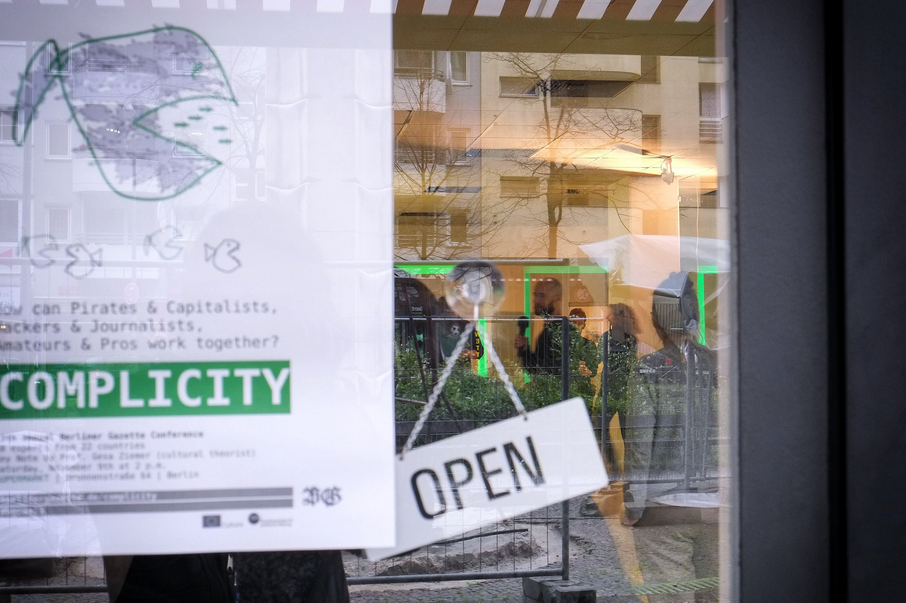
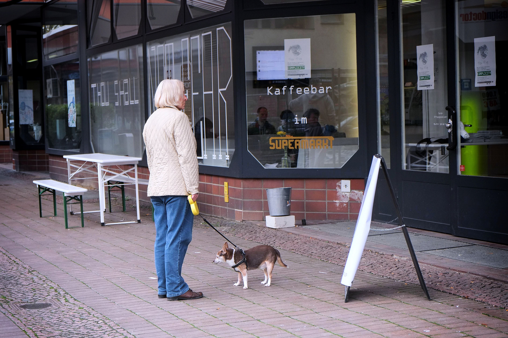
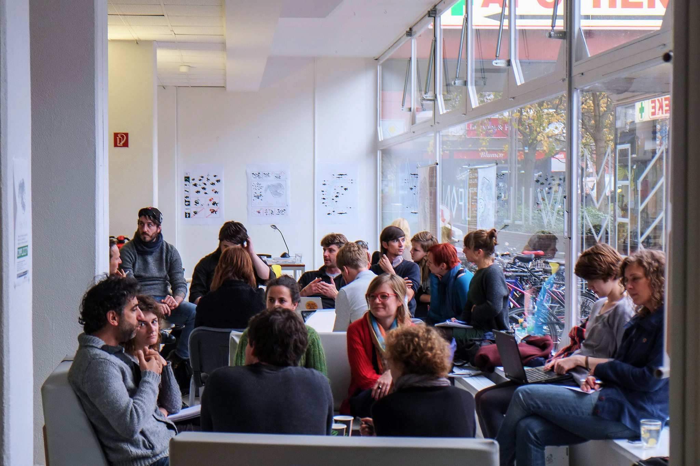
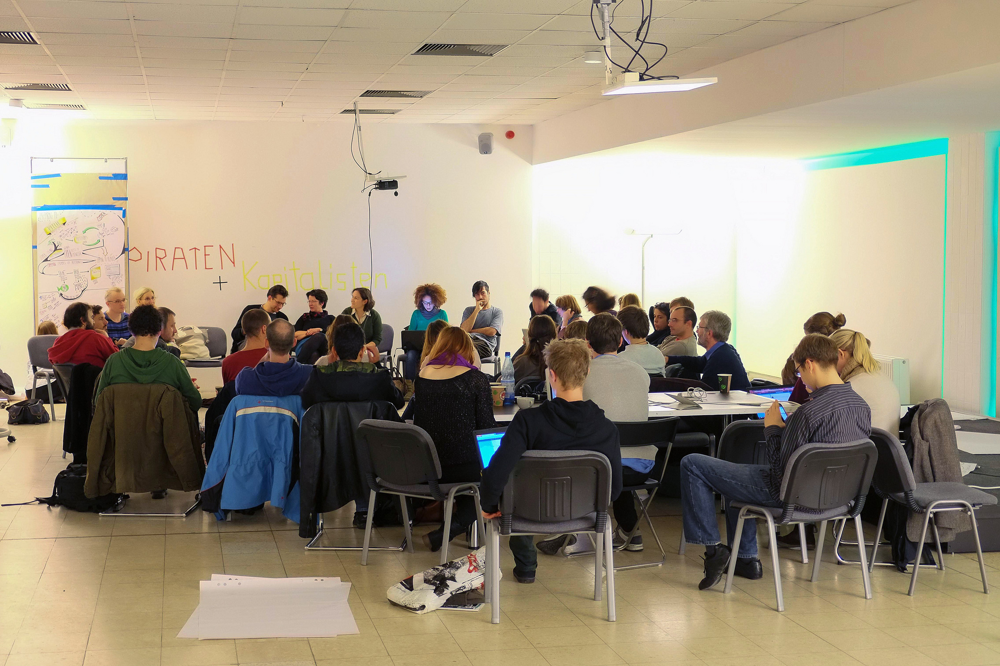
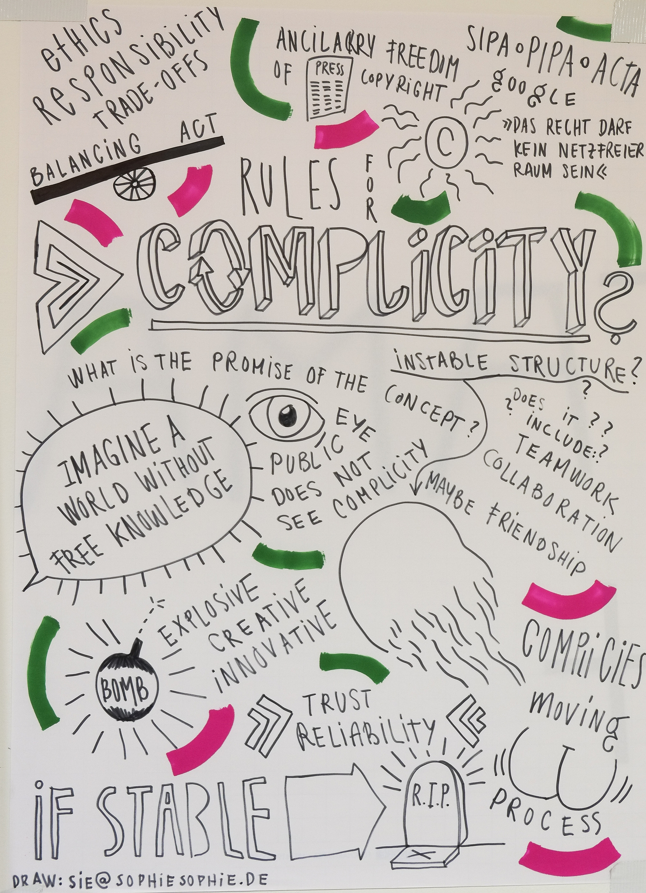

### Das Setting

Wie können "Piraten und Kapitalisten" zusammenarbeiten? Fünfzehn
Menschen, die meisten zwischen 25 und 35 Jahre alt und im Auftreten eher
lässig als *businesslike*, wollen es herausfinden. Die Gruppe schart
sich mit ihren Laptops um eine Mehrfachsteckdose wie um ein Herdfeuer.
Nicht weit entfernt davon versammeln sich "Hacker und Journalisten"
sowie "Profis und Amateure", um mögliche Verbindungen und Kooperationen
zwischen ungleichen Partnern auszuloten.

Doch wer ist hier wer? Der Einladung des Veranstalters "Berliner
Gazette" sind etwa 50 Künstler, Journalisten, Hacker,
Kulturwissenschaftler, Soziologen, Juristen und auch zwei
Bibliothekarinnen gefolgt. Viele stammen aus Berlin und Deutschland.
Andere kommen aus Spanien, Portugal und Griechenland – den
Krisenländern, Weißrussland und Mazedonien – Ländern mit aktueller
Zensurerfahrung, sowie Kroatien, wo die Erinnerungen an Nationalismus
und Krieg noch frisch sind. Der Horizont ist also weit gespannt, die
Hintergründe sind vielfältig. Man spricht Englisch. Alle Anwesenden sind
aktiv, ein passives Publikum ist nicht vorgesehen.

Wir sind bei der 13. Jahreskonferenz der Berliner Gazette, eines
erfolgreichen Berliner Online-Magazins zu Journalismus, Kunst und
Wissenschaft.[^2] Die Berliner Gazette wurde 1999 von Krystian Woznicki als
Feuilleton und experimentelle Plattform im Internet gegründet. Woznicki,
Chefredakteurin Magdalena Taube und ihr Team verbinden
Online-Journalismus mit Offline-Aktivitäten: Sie organisieren Symposien
und Seminare zur Medienkultur und kooperieren dabei mit Partnern wie
Kulturinstitutionen, politischen Stiftungen, Schulen und Hochschulen.
Jedes Jahr wählt die Berliner Gazette ein Schwerpunktthema.[^3] Die
Complicity-Konferenz vom 7. bis 9. November 2013 bildet den Auftakt für
das Jahresthema 2014. Tagungsort ist der SUPERMARKT in
Berlin-Wedding.[^4]. Vor wenigen Jahren ratterten in der schmucklosen
Betonhalle noch Einkaufswagen zwischen Regalen entlang. Nach der
Schließung des Discounters und einer Phase des Leerstandes gründeten Ela
Kagel, David Farine und Zsolt Szentirmai im Jahr 2010 den SUPERMARKT neu
– als Konferenz- und Workshopzentrum, Café und Coworking Space. Wenn
nicht gerade die Berliner Gazette hier tagt, wird er von Berliner
Internetaktivisten und jungen Start-Ups genutzt.

Die Atmosphäre während der drei Konferenztage im November 2013 ist
entspannt und hoch konzentriert zugleich. Während morgens der geplante
Anfangszeitpunkt verstreicht, kommt man bei Kaffee und Croissants schon
einmal mit anderen Teilnehmern ins Gespräch. In den Workshops wird dann
so leidenschaftlich diskutiert, dass darüber die Pizza kalt wird; doch
unaufgeregte Moderatoren behalten die Lage unter Kontrolle. Und da hier
schon von "Konferenzkultur" die Rede ist: Eine gute Gedächtnisstütze und
zugleich ästhetisch reizvoll sind die *Graphic Recordings*, mit denen
eine Do-It-Yourself-Masterklasse des SUPERMARKTs (Leitung: Gabriele
Schlipf, momik Berlin) die Workshops live dokumentiert.

### Die Aufgabe

Warum heißen wir eigentlich "Piraten und Kapitalisten", und wer ist wer?
In der Vorstellungsrunde wird deutlich: Fassen wir unter "Piraten" die
Aktivisten, die für eine freie Grundstruktur des Internet und für
Informationsfreiheit eintreten, dann sind wir fast alle Piraten.
Allerdings distanzieren sich einige Teilnehmer entschieden von Formen
"piratischen" Handelns wie dem illegalen Filesharing in Datenbanken -
etwa der Musiker, der es ablehnt, "to rip off someone else’s stuff".
"Kapitalisten", da ist sich die Gruppe einig, sind die *Global
Players*wie Google und Amazon, die durch ihre kommerziellen Interessen
die Freiheit im Internet gefährden. Vielleicht nicht überraschend, will
sich unter uns kein Kapitalist finden.

Den Workshop moderieren der Hacker-Künstler Nenad Romić´ alias Marcell
Mars aus Zagreb und der Berliner Chris Piallat, Redaktionsmitglied der
Berliner Gazette sowie Referent für Netzpolitik bei den Grünen.

Marcell Mars’ Eingangsreferat führt uns in das Szenario einer utopischen
virtuellen globalen Public Library mit Sitz in Island ein und setzt
Impulse für das Rollenspiel der Gruppe: *Stellt euch vor, ein ganzes
Land agierte piratisch. Stellt euch vor, das kleine Land Island spielte
den Vorreiter und würde das gesamte Wissen digital verfügbar machen und
eine digitale Bibliothek aufbauen. Welche gesellschaftlichen,
kulturellen und wirtschaftlichen Folgen würden sich daraus ergeben?*
Dass die traditionelle Institution Bibliothek obsolet sei, setzt dieses
Szenario gleichsam voraus: Seit der Digitalisierung sei sie von
kommerziellen Interessen bedroht und durch das geltende Copyright
geknebelt. Auch könne sie die Ansprüche ihrer Klientel längst nicht mehr
erfüllen, die sich deshalb eigene, oft illegale Informationsstrukturen
aufbauten. 

Diese Idee einer globalen, digitalen Bibliothek setzt schnell
Assoziationen frei. Während die Einen fragen, welche konkreten Schritte
es zur Umsetzung dieser Utopie braucht, interessieren sich andere für
Rechte und Rechtsverluste, verwickeln sich in Urheberrechtsdebatten und
kommen dann schnell zur Frage nach alternativen Einkommensquellen für
Kulturschaffende. Ein Anliegen bringen Kulturschaffende und Künstler
immer wieder eindringlich vor: Wir wollen unsere Werke digital frei zur
Verfügung stellen – aber wir wollen auch von unserer Arbeit leben
können! 

### Zwischen Traum und Realität

In dem Szenario der "Piraten und Kapitalisten" erscheint "die
Bibliothek" weniger als konkrete Institution denn als Projektionsfläche
für gesellschaftliche Utopien. Die Vision beschreibt mit einer
öffentlichen Universalbibliothek einen virtuellen Ort gelebten
Austausches, gelebter Demokratie von Gleichen. Wissen und Kultur gehören
der Gesellschaft und sind Gemeingut. Eine kommerzielle Ökonomie des
Wissens hat hier keinen Platz. Diese digitale Superbibliothek war schon
der Traum der Internetpioniere, bevor das Netz zum Shoppingparadies und
zur Zerstreuungshölle wurde, der datengetriebene Kapitalismus zum
Höhenflug ansetzte.

### Kritische Fragen an die Utopie der globalen Bibliothek

Doch nicht alle sind bereit, der Utopie zu folgen, ohne die immerhin
noch real existierende Bibliothekswelt unter die Lupe zu nehmen. Als wir
uns in kleine Untergruppen aufteilen, um einzelne Probleme zu
untersuchen, formiert sich ein gallisches Dorf (Iskra, Simon und
Corinna) zur Verteidigung der realen Bibliothek.

Die Kulturvermittlerin Iskra Geshoska aus Skopje, Simon Worthington, der
"Dreampunk" und Entwickler hybrider Leseformate aus London/Lüneburg und
die Bibliothekarin Corinna Haas aus Berlin denken über "Libraries and
Education" nach. "Was machen Bibliotheken eigentlich?", fragen Iskra und
Simon die Autorin gleich zu Beginn. Schnell zeigt sich, dass die beiden,
und das dürfte für viele andere Konferenzteilnehmer auch gelten, über
die Aufgaben und aktuellen Arbeitsschwerpunkte von Bibliotheken nicht
sehr viel wissen: Die zunehmende Anzahl von Digitalisierungsprojekten,
die Entwicklung von Standards für die digitale Langzeitverfügbarkeit,
Aktivitäten im Bereich Forschungsdatenmanagement, die Unterstützung von
Forschungs- und Publikationsprozessen, das Engagement von Bibliotheken
im Gebiet Leseförderung und Vermittlung von Informationskompetenz, die
Rolle der Bibliothek als gesellschaftlicher Raum und (physischer)
Lernort und so weiter. Auch wenn Anspruch und Wirklichkeit von
Bibliotheken nicht immer übereinstimmen, wird doch aus den Ausführungen
der Bibliothekarin schnell deutlich, dass Bibliotheken mehr leisten, als
nur Informationsressourcen bereit zu stellen, wie eine reine Datenbank –
sie unterstützen auf der Basis gemeinsamer gesellschaftlicher Werte
Lernen, Bildung und Forschung auf vielen Ebenen. (Und die Grenzen
zwischen Wissensinstitutionen wie Bibliothek, Schule und Universität
sind heute durchlässig geworden.)

Kritische Fragen, die unser gallisches Grüppchen dann unter der
Überschrift "The Library Protest" dem Plenum stellt, sind etwa: Wollt
Ihr wirklich Bibliotheken abschaffen oder für überflüssig erklären? Wer
sagt Euch, dass Ihr den Regierungen damit nicht nahe legt, auch gleich
die Universitäten zu schließen und durch Online-Vorlesungen zu ersetzen?
Und danach die Schulen?

Die Großgruppe der Piraten reagiert ein wenig irritiert auf unsere
Präsentation, da wir uns nicht auf die Island-Utopie eingelassen hätten.
Vielleicht, um uns wieder ins Boot zu holen, interpretiert dann jemand
unsere reale Bibliothek als "universal classroom" – und führt sie so in
die utopische Sphäre zurück.

### Vertraute Thesen

Die Utopisten vertreten derweil vertraute Thesen, stellen Fragen, wie
wir Bibliothekarinnen sie aus der frühen Open Access-Bewegung kennen:
Wozu braucht es Verlage, wenn wir doch alle selber Verleger sein können?
Spielen die Verwertungsgesellschaften nicht eher eine unheilige Rolle?
Sind Initiativen wie die Cultural Commons Collecting Society, kurz C3S,[^5]
als Gegenmodell zur Gema ein Vorbild auch für Wortkünstler? Ist das mit
dem Urheberrecht verbundene Geldversprechen für Künstler wirklich mehr
als ein großes Glücksspiel? Werden hier nicht vor allem die
Zwischenhändler, Agenturen, Verlage geschützt? Die Forderung:"Cut the
middleman!" wird auf *Graphic Recordings* festgehalten. Am Ende der
Diskussion steht auf einem Plakat der Ausspruch: Nicht jeder Künstler
kann Lady Gaga sein. Nicht jeder wird mit seinem Werk Millionen
verdienen können. Urheberrecht hin, Urheberrecht her.

### Lessons Learned

Wir haben bei der Complicity-Konferenz sehr viel von Journalisten,
Kreativen und Programmierern über ihre Probleme mit und ihre Sicht auf
das geltende Urheberrecht gelernt. Wir waren beeindruckt von der Energie
und dem *community spirit* unter den Konferenzteilnehmern. Und wir haben
uns erzählen lassen, was von Bibliotheken – utopischen und realen –
erwartet wird:

**1. Die Zukunft der Bibliotheken findet sich in ihrer Vergangenheit.**
Wenn Bibliotheken sich auf ihre Grundaufgabe, Zugänge zu Information und
Bildung zu schaffen, zurück besinnen, haben sie auch im digitalen
Zeitalter eine Jahrhundertaufgabe vor sich.

**2. Je ungelöster die Urheberrechtsprobleme, desto attraktiver wird
piratisches Handeln**.
Wer hat noch nie einen Musiktitel geteilt oder eine PDF-Datei weiter
geschickt? Die Behinderung wissenschaftlicher Arbeit durch rechtliche
und finanzielle Hürden wird längst nicht mehr widerstandslos
hingenommen. Seht hin, Bibliothekare: Wissenschaftler versorgen sich mit
Literatur aus illegalen Datenbanken und packen am Rande von Konferenzen
ihre Festplatten aus, um "befreite Bücher" auszutauschen. Und "Piraten"
arbeiten fleißig daran, immer größere illegale Datenbanken aufzubauen.

**3. Je sozial akzeptierter piratisches Handeln, desto größer wird der
Druck der "kritischen Masse" auf den Gesetzgeber.**
Die Gesetzgebung ist
träge und hinkt zwangsläufig gesellschaftlichen und technologischen
Entwicklungen regelmäßig hinterher. Doch wie viele illegale Downloads
und illegale Digitalisierungen muss es noch geben, damit das
Urheberrecht für die Wissenschaften und die lernende Gesellschaft eine
zeitgemäße und praktikable Form erhält? Denn selbst wenn man es wollte,
könnte man nach den bestehenden Vorgaben kaum beides haben: Absolut
urheberrechtskonform handeln und zugleich an der digitalen Kultur und
der digitalen Wissenschaft teilhaben.

**4. Internetaktivisten und Bibliothekare wissen viel zu wenig
voneinander!**
Vielleicht liegt es am unterschiedlichen professionellen Habitus und der
großen Kluft, die Bibliothekare vom "intelligenten Leben jenseits der
Festanstellung" (Friebe/Lobo 2006) trennt: Jedenfalls wissen
Bibliothekare und Internetaktivisten offenbar sehr wenig voneinander.
Dabei gleichen sich ihre Ziele auf verblüffende Weise: Beide Gruppen
wollen den freien Zugang zur Information! Eine größere Offenheit auf
beiden Seiten und sehr viel mehr "fachfremder" Austausch wären dienlich.
Es gibt dafür Veranstaltungsformate - die Berliner Gazette hat es
vorgemacht. Machen wir es nach!

### Komplizen

Das theoretische Konzept zu der Veranstaltung "Complicity –
Komplizenschaft" lieferte die Hamburger Philosophin und
Kulturanthropologin Geza Ziemer (Ziemer 2013) am letzten Tag. Mit dem
Konzept der "complicity" beschreibt sie Formen der Konnektivität und der
Kollaboration, die sich in den letzten Jahren entwickelt haben. Sie
definiert Komplizenschaft als lose Verbindung zwischen Menschen, die
sich in der Regel jenseits der Gesetze zu einer Tat verabreden. Es sind
zufällige Begegnungen, die Menschen zu Komplizen machen. Komplizen
suchen sich nicht, sie finden sich und das oftmals nonverbal (etwa durch
mimische Signale). Komplizen verständigen sich, planen, handeln und
gehen danach wieder auseinander. Das unterscheidet Komplizenschaften von
Netzwerken (in denen man passiv bleiben kann) oder festen kollegialen
Strukturen.

Weitere Vorträge stellen gelebte – oder auch konstruierte, denkbare –
Komplizenschaften vor. Da berichten unter der Überschrift "Hacker und
Journalisten" Sebastian Candea, Journalist aus Bukarest und Stefan
Mondial, Programmierer aus Deutschland, über das investigative Projekt
Offshore Leaks.[^6] Beispiele einer gelungenen Zusammenarbeit von "Amateuren
und Profis" im Bereich  Musik benennen Mitsuhiro Takemura, Crypton
Future Media und Valje Djordjevic, iRights Media Berlin. Eindrucksvoll
vermessen sie die Überschneidungen zwischen kommerzieller
Musikproduktion, Fankultur und Nutzerkreativität. Zitiert wird dies am
Beispiel der Gesangssoftware Hatsune Miku, die sich in Asien zu einem
populären Trend entwickelt hat und nun auch Europa erreicht hat. Eine
glückliche Verbindung von "Kapitalisten und Piraten" findet Michiel de
Jong schließlich im Projekt Opentabs, das dazu beitragen soll, ein
Wirtschaftssystem ohne Banken zu etablieren.[^7]

Internet- und Medienaktivisten, CopyLeft-Advokaten – die Komplizen der
Bibliotheken wissen sehr, sehr gut Bescheid. Sie kennen die Nöte der
Bibliotheken, die Tücken des Urheberrechts, die Fallstricke in den
Lizenzverträgen mit Wissenschaftsverlagen, die Grenzen der Onleihe und
die Hürden auf dem Weg zu einer freien, digitalen Privatkopie. Je
radikaler die Komplizen, desto weniger wollen sie die Bibliothek als
besseren Coworking Space. Stattdessen sollen die Bibliotheken sich auf
ihre alten Werte, die Demokratisierung des Wissens, Zugänglichkeit zu
schaffen, auch im digitalen Zeitalter rückbesinnen. Die Öffentliche
Bibliothek als Idee hat nicht ausgedient, im Gegenteil gilt es für diese
Idee neu zu kämpfen. Das wurde besonders deutlich in Gesprächen mit
Intellektuellen aus Ländern, in denen weder politisch noch ökonomisch
die Voraussetzungen für den freien Zugang zu Informationen und Bildung
und die entsprechenden Institutionen, also Bibliotheken, gegeben sind.

Manche unserer Komplizen fangen schon einmal an und füllen illegale
Portale wie Library Genesis,[^8] oder sie engagieren sich in Kunstprojekten
wie memoryoftheworld.org.[^9] Aber auch unsere gar nicht so fernen Nachbarn
in Norwegen machen Nägel mit Köpfen: Die norwegische Nationalbibliothek
erklärte im Dezember 2013, den Gesamtbestand norwegischer Literatur
digitalisieren und für den norwegischen IP-Bereich frei zugänglich
machen zu wollen. Allerdings steht nur Literatur mit Erscheinungsjahr
bis 2001 für Leser kostenfrei online zur Verfügung. Dem vorausgegangen
war eine Einigung der norwegischen Rechteinhabern und der Bibliothek.[^10]
Mit dieser Initiative rückt das auf der Konferenz leidenschaftlich
beschworene Szenario in einem Teil von Europa schon ein wenig näher. So
bleibt am Ende die Frage: Mit welchen Komplizen können sich
Bibliothekare verbünden, damit die deutsche Bibliothekslandschaft
"norwegischer" wird?

### Literatur

Friebe, Holm ; Lobo, Sascha (2006): Wir nennen es Arbeit. Die digitale
Bohème, oder: Intelligentes Leben jenseits der Festanstellung, München:
Heyne

Taube, Magdalena ; Woznicki, Krystian (2014, erscheint demnächst):
Komplizen. Wie können Hacker und Journalisten, Piraten und Kapitalisten,
Amateure und Profis zusammenarbeiten? Berlin, iRights Media (Ebook)

Ziemer, Gesa (2013): Komplizenschaft. Neue Perspektiven auf
Kollektivität Bielefeld: Transcript

[^1]:Wegen der besseren Lesbarkeit verwenden wir den männlichen Plural, den
wir als geschlechterübergreifend auffassen.

[^2]:Konferenzwebsite:
[http://berlinergazette.de/symposium/complicity/](http://berlinergazette.de/symposium/complicity/)

[^3]:[http://berlinergazette.de/ueber-uns/](http://berlinergazette.de/ueber-uns/)

[^4]:[http://www.supermarkt-berlin.net/](http://www.supermarkt-berlin.net/)

[^5]:[https://www.c3s.cc/](https://www.c3s.cc/)

[^6]:[http://www.icij.org/offshore](http://www.icij.org/offshore)

[^7]:[http://opentabs.net/](http://opentabs.net/)

[^8]:[http://lib.freescienceengineering.org/view.php?id=549037](http://lib.freescienceengineering.org/view.php?id=549037)

[^9]:Marcell Mars stellt memoryoftheworld z. B. in diesem Podcast vor:
[http://vimeo.com/60889534](http://vimeo.com/60889534)

[^10]:Mehr Informationen zur norwegischen Digitalisierungsinitiative:
[http://www.lesen.net/ebook-news/der-staat-zahlt-norweger-koennen-kommerzielle-ebooks-kostenlos-online-lesen-9430](http://www.lesen.net/ebook-news/der-staat-zahlt-norweger-koennen-kommerzielle-ebooks-kostenlos-online-lesen-9430)